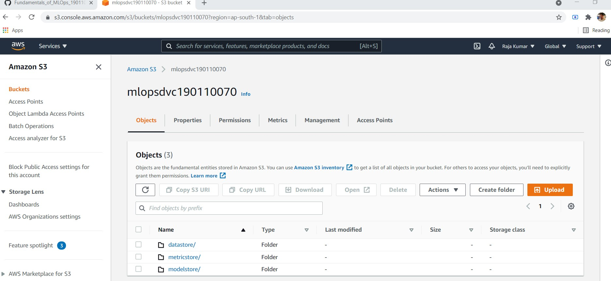
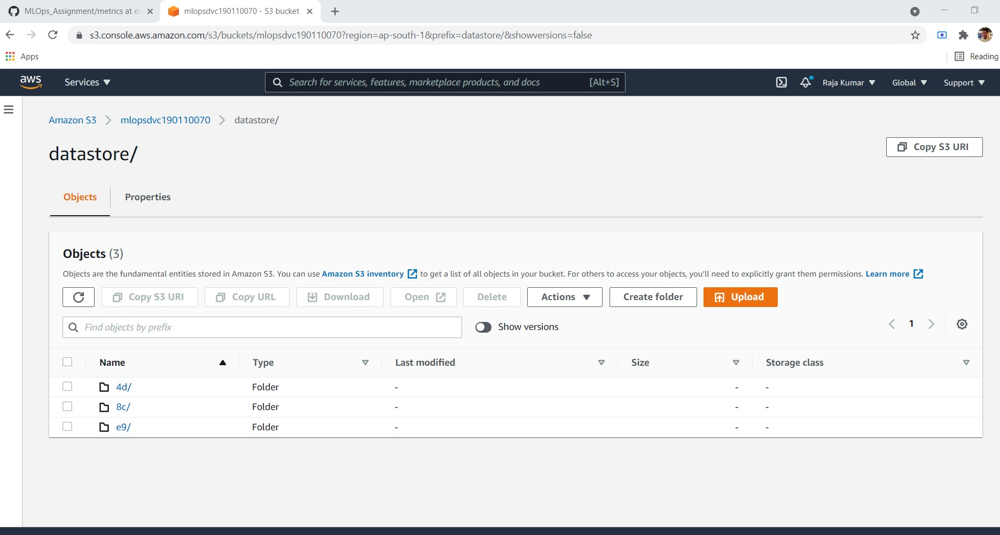
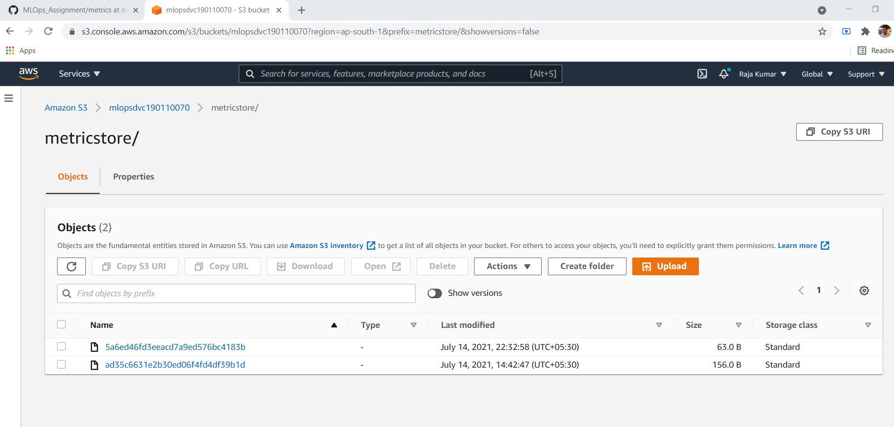
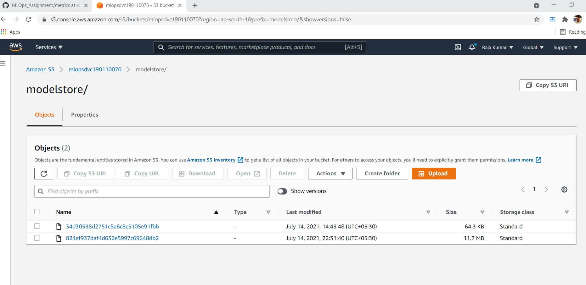

# Link to MLOps Assignment
https://github.com/raja-7-c/MLOps_Assignment

# Part 1

The first part of this assignment is to evaluate your basic understanding of DVC & its functionalities, as mentioned in the notes. In this part, you need to do the following:

- Create an empty (public) GitHub repository named `MLOps_Assignment` *(This will be a separate repo from the one that you have submitted earlier).* Clone it & initialize it as a DVC repository.
- Create a `data/` folder inside `MLOps_Assignment`.
- Create a folder named `external_cache` outside this repo & set it as the cache for the repository. *(Check out the [DVC command reference](https://dvc.org/doc/command-reference) for help)*
- Download the `creditcard.csv` file from [this Credit Card Fraud dataset](https://www.kaggle.com/creepycrap/creditcard-fraud-dataset), place it in the `data/` folder & enable DVC tracking for it.
- Create a new Amazon S3 bucket (name it anything you want).
- Set the S3 bucket as the default remote for the DVC repo & upload the dataset to this bucket (into a folder named `datastore`).

***$ git clone https://github.com/raja-7-c/MLOps_Assignment***

***$ git remote add origin https://github.com/raja-7-c/MLOps_Assignment***

***$ git branch -M main***

***$ dvc init***

***$ mkdir data***

***$ touch data/.gitkeep***

 $ git add *

***$ git commit -m "create data directory"***

***$ git push***

***$ cd ~/Desktop/***

***$ mkdir external_cache***

***$ cd ~/Desktop/MLOps_Assignment/***

***$ dvc cache dir C:/Users/hp/Desktop/external_cache***

***$ dvc cache dir(for confirmation)***

***$ dvc add data/creditcard.csv***

***$ dvc remote add -d storage s3://mlopsdvc190110070/datastore***

***$ dvc push***

# Part 2

The second part of this assignment is designed to give you a flavor of how DVC can be used to track ML artifacts (data, models & metrics) across multiple experiments in an ML project, by simply leveraging the basic features of DVC that we have learnt so far. To accomplish this part of the assignment, you need to do the following:

- Create the required folders such that the structure of the `MLOps_Assignment` repository looks like the [generic ML project directory structure](https://www.notion.so/Week-2-Data-Model-Management-with-DVC-1bdbe182a0d344cca193c9cdb7e18a64).
- Checkout a Git `branch` named `expt1_dt` & create an `expt.py` file within `src/` folder, which does the following:
    - Reads the actual data file stored in the DVC remote (use `dvc.api`) into a `pandas` dataframe
    - Performs the relevant feature engineering as you may deem necessary based on your EDA (optional)
    - Splits the data into 80 : 20 (train : test) ratio (while trying to maintain the relative proportion of target label `Class` in each split) & saves the splits as `data/processed/train.csv` & `data/processed/test.csv`
    - Trains a **Decision Tree model** (use `scikit-learn`) using `entropy` as the splitting criterion on the `data/processed/train.csv`
    - Saves the trained model as `models/model.pkl`
    - Evaluates the trained model on the test data (`data/processed/test.csv`) using the **Accuracy** & ***weighted* F1 Score** & saves the results into a JSON file `metrics/acc_f1.json`
 - Run this script to generate the various files (processed data, model & metrics). Use DVC to track these files & upload them to the S3 bucket such that:
    - The data resides in the `datastore` folder
    - The model resides in the `modelstore` folder
    - The metrics reside in the `metricstore` folder
- Switch to a new branch on Git & name it `expt2_rf`
- Modify the `src/expt.py` file to train a **Random Forest model** (with appropriate hyperparameters) this time instead of the decision tree model (let all other code remain the same)
- Run this script to generate the new model & its corresponding metrics file
- Track these new artifacts & upload them to the DVC remote

With this, you have now been able to use DVC to not only track data, but also other ML artifacts like models & metrics across experiments using DVC. You can switch between the 2 branches that you created & do a `dvc checkout` to sync the artifacts corresponding to the respective experiment.

***$ mkdir metrics***

***$ touch metrics/.gitkeep***

 $ git add *

***$ git commit -m "Plots & logs containing performance metrics"***

***$ git push***

***$ mkdir models***

***$ touch models/.gitkeep***

 $ git add *

***$ git commit -m "Trained models"***

***$ git push***

***$ mkdir src***

***$ touch src/.gitkeep***

 $ git add *

***$ git commit -m ".py files for preprocessing, training, evaluation, etc."***

***$ git push***

***$ cd data/***

***$ mkdir prepared***

***$ touch prepared/.gitkeep***

 $ git add *

***$ git commit -m "prepared datasets"***

***$ git push***

***$ cd ~/Desktop/MLOps_Assignment/***

***$ git checkout -b expt1_dt***

***DECISION TREE MODEL ON CREDITCARD.CSV***

***{"F1_Score": 0.9984327092155867,
"Accuracy": 0.9982093325374811}***

***$ git checkout -b expt2_rf***

***RANDOM FOREST MODEL ON CREDITCARD.CSV***

***{"F1_Score": 0.999496616792791, 
"Accuracy": 0.9995084442259752}***

